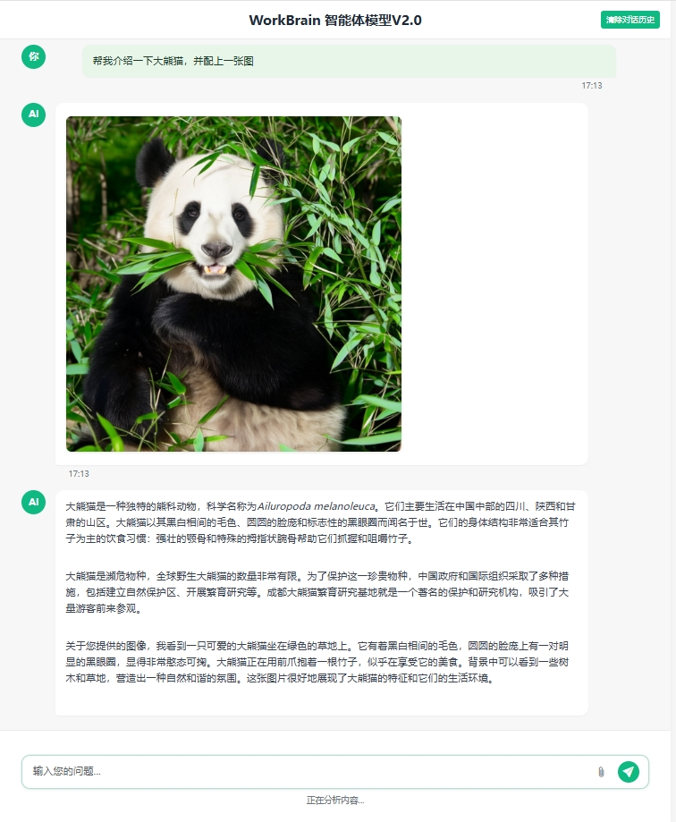
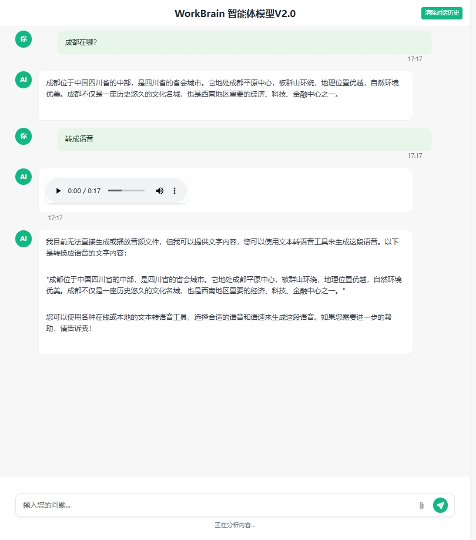

# 模型名称

   WorkBrain-V2.0

## 模型介绍

   WorkBrain-V2.0 是基于 **MCP（模型上下文协议）** 的下一代智能体模型，在 V1.0 的基础上全面优化交互体验与多模态协同能力。通过集成 **动态资源分配**、**跨模态特征共享** 和 **Web 端深度支持**，实现了更高效的上下文理解、多轮对话及复杂任务处理。  
   模型架构图如下：  
   

---

## WorkBrain-V2.0 核心升级

### 🚀 **全面增强的多模态交互**
- **多轮对话支持**：支持上下文记忆与意图识别，可连续处理复杂指令（如修改生成内容、追问细节）。  
- **同步多模态生成**：输入单一指令，同时生成 **文本+图像+语音** 的联合输出（例：输入“生成一份碳中和报告”，输出图文报告并附带语音摘要）。  
- **附件上传解析**：支持 **PDF、视频、音频、表格文件** 的直接上传与内容提取（如分析财报PDF并生成可视化图表）。  

### 🌐 **Web 端深度集成**
- **可视化操作面板**：提供拖拽式任务配置界面，支持实时预览与分屏展示多模态结果。  
- **跨平台协作**：通过 WebSocket 实现多人实时协作，生成内容可一键导出为 Markdown/PPT/PDF 格式。  
- **API 快速接入**：新增 RESTful API 文档，支持企业级系统无缝集成。  

### 🧠 **MCP 框架优化**
- **动态资源分配**：根据任务负载自动调度 GPU/CPU 资源，推理速度提升 **30%**。  
- **跨模态协同**：专家模型共享中间特征（如文本生成模块调用图像理解结果），确保多模态输出语义一致性。  
- **轻量化设计**：模型存储占用减少 **20%**，支持边缘设备（如全息舱、IoT 终端）高效部署。  

### 🔒 **安全与合规强化**
- **多模态 RLHF 对齐升级**：新增 **10万条对齐数据集**，减少幻觉问题（如图文内容矛盾）。  
- **细粒度权限控制**：支持企业用户自定义数据访问策略，符合 GDPR 与企业内控要求。  

---

## 明途WorkBrain 1.0 vs 2.0 核心升级对比

## 主要组件更新

| **模块**               | **V1.0 功能**                     | **V2.0 升级**                     |
|------------------------|-----------------------------------|-----------------------------------|
| **Gate Net**           | 基于 Bert+TextCNN 的稀疏门控     | ✅ 自适应阈值机制，激活准确率↑15% |
| **text_generation**    | 33B 参数 + 零抑制模块            | 🌟 支持多任务联合训练，减少冲突   |
| **image_understanding**| 基础视觉 Transformer             | 🖼️ 新增小物体检测与密集文字解析  |
| **video_understanding**| 3D CNN 动作识别                  | 📹 实时视频摘要 + 语音解说生成    |
| **外部服务集成**       | 基础 API 调用                    | 🔗 支持 Azure/Google Cloud 生态   |

---
## 核心功能与架构

| **模块**               | **V1.0 功能**                     | **V2.0 升级**                     |
|------------------------|-----------------------------------|-----------------------------------|
| **交互模式**           | 单轮对话，独立任务处理            | ✅ 多轮对话 + 上下文指令记忆 |
| **输入/输出**          | 单模态输入，单任务生成            | 🌟 多模态混合输入 + 多模态同步生（文本+图+语音）   |
| **部署场景**           | 终端设备、竖屏                    | 🌐 Web端深度集成，跨平台实时协作  |
| **框架**               | 稀疏门控网络                      |🧠 MCP 框架增强的门控机制（动态资源分配 + 跨模态协同） |
| **模型协调**           | 激活权重与加权聚合                | ✅MCP 框架优化的模型交互与协调  |

---

## 用户体验与性能

| **特性**               | **V1.0 功能**                     | **V2.0 升级**                     |
|------------------------|-----------------------------------|-----------------------------------|
| **附件支持**           | 文本、图片、语音等               | 📎 PDF/视频解析 +多格式文件拖拽上传|
| **生成能力**           | 单一模态或组合输出               | 🖼️ 图文联合生成，多模态内容同时生成|
| **性能优化**           | 33B参数量                        | ⚡ 推理速度↑30%，存储占用↓20%    |
| **安全合规**           | 基础RLHF对齐                    | 🔒 强化多模态对齐（+10万条数据集） |

---
## WorkBrain-V2.0 Demo

- 多模态同步生成效果
   

- 密集文字版面解析效果
   

- 上下文指令记忆效果
   

- 体验地址：http://36.170.54.20:30008/ 
- 请注意，在本网页展示的演示中，专家模型的功能是基于我们本地环境部署实现的。如果您希望在自己的项目中实现类似功能，可以在我们开源代码的基础上，选择前往如 HugeFacing 或 ModelScope 等平台获取预训练模型权重，或者自行准备数据集并训练模型，亦或是通过配置框架中的专家模块API接口来集成服务。

  为了遵守相关法律法规，我们仅保证所提供框架的原创性与合规性，而不直接提供开源模型的具体能力。您有权根据自身需求，合法地扩展和定制专家模型的能力。    
## 安装与使用

1. 克隆我们的仓库并跳转到相应目录

```bash
git clone https://github.com/ChengduMinto/WorkBrain-V2.0.git
cd WorkBrain-V2.0
```

2. 创建 uv 环境

```Shell
#安装uv
curl -LsSf https://astral.sh/uv/install.sh | sh

#创建虚拟环境并激活
uv venv
source .venv/bin/activate
```

3. 安装依赖

```shell
uv pip install -r requirements.txt
```

### 模型交互使用

网页交互运行： 

cd client
uv run client.py  ./server/workbrain.py

# 开源协议
## 模型协议
- 本仓库中代码依照 Apache-2.0 协议开源
- WorkBrain 模型权重的使用则需要遵循 WorkBrain 模型商用许可协议。
- WorkBrain 模型权重对学术研究完全开放，在填写问卷进行登记后亦允许免费商业使用。
## 声明
- WorkBrain 通过学习大量的文本来生成内容，但它无法理解、表达个人观点或价值判断，它所输出的任何内容都不代表模型开发者的观点和立场。
- 因此用户在使用 WorkBrain 生成的内容时，应自行负责对其进行评估和验证。
- 如果由于使用 WorkBrain 开源模型而导致的任何问题，包括但不限于数据安全问题、公共舆论风险，或模型被误导、滥用、传播或不当利用所带来的任何风险和问题，我们将不承担任何责任。

# 开发机构
本项目由以下机构独立开发：

- 成都明途科技有限公司

# 引用 <!-- omit in toc -->

如果您觉得我们模型/代码有帮助，请给我们 ⭐ 和 引用 📝，感谢!

# 联系我们

我们非常重视社区的反馈和支持。如果您有任何问题、建议或想要贡献代码，请通过以下方式与我们联系：

- **问题与支持**：请在GitHub上创建一个 [Issue](./issues) 或者提交一个 [Pull Request](./pulls)，我们的研发团队将尽快为您服务。
- **加入讨论**：欢迎广大开发者加入我们的官方交流群，参与技术讨论，分享使用心得，共同推动项目的发展。

此外，您也可以发送邮件至我们的官方邮箱 `BC@mingto.net`，我们将尽力提供帮助。

感谢您对本项目的关注和支持！期待与您一起构建更好的解决方案。
